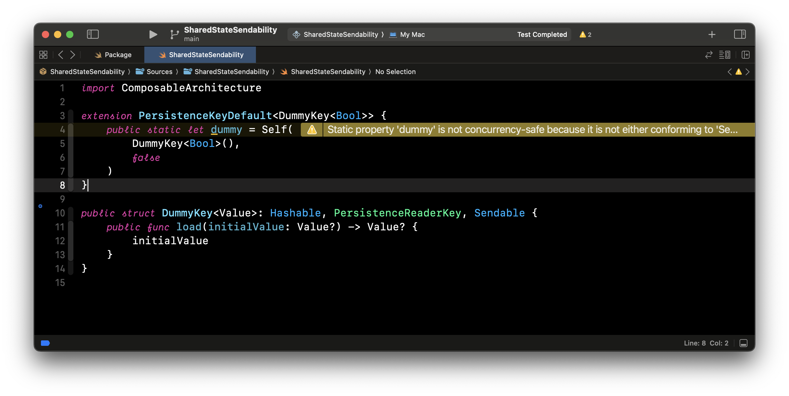

[Follow up on Slack thread](https://pointfreecommunity.slack.com/archives/C04KQQ7NXHV/p1716281323276589?thread_ts=1715946566.426739&cid=C04KQQ7NXHV)

Tiny TCA project demonstrating sendability warnings related to `PersistenceKeyDefault` not being sendable - **N.B. `enableExperimentalFeature("StrictConcurrency")` is used!**

```swift
import ComposableArchitecture

extension PersistenceKeyDefault<DummyKey<Bool>> {
	public static let dummy = Self(
		DummyKey<Bool>(),
		false
	)
}

public struct DummyKey<Value>: Hashable, PersistenceReaderKey, Sendable {
	public func load(initialValue: Value?) -> Value? {
		initialValue
	}
}

```



That is it...
